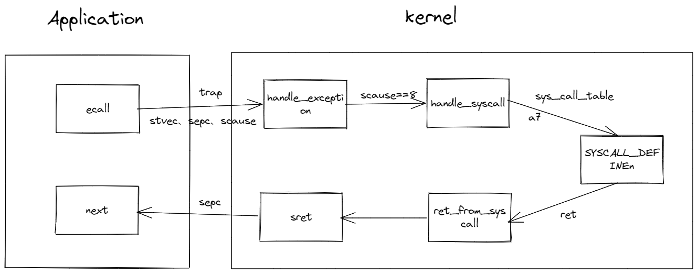
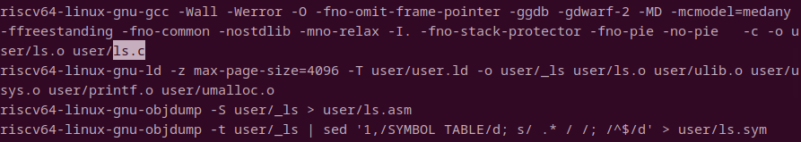

**系统调用**是用户程序请求操作系统服务的接口。

**系统调用**会陷入到内核态，执行完对应的操作系统服务后，重新返回到用户态，并带回系统调用的返回值。

**系统调用**被伪装成函数调用。对用户态程序而言，执行系统调用就像一次函数调用。

对于RISCV的CPU而言，请求系统调用的指令是ecall，在执行该指令前，需要先把系统调用的参数放到参数寄存器(a0-a6)中，还有系统调用的ID(以便操作系统调用对应的服务函数)放到寄存(a7)器中，ecall执行完后，返回值已经放到了寄存器a0，对用户态的代码程序而言，跟函数调用一样。

实际上，执行ecall指令，系统陷入到内核态，CPU干的活儿可能比想象的要多很多。比如，系统调用可能是要从磁盘上读取文件，或者都需要等待某一信号量，这会阻塞当前的进程，导致发生任务切换，CPU再次回到用户态时，运行的是另外一个进程了。但这没有关系，因为文件读取总有完成的时候，信号量也有等到的时候，这个时候原来的进程会恢复运行，这个时候系统调用真正完成，带着返回值，返回到用户态继续执行。

打个比方，用户态程序执行系统调用时，它的世界就像被冰冻住了一样，但时间还在流逝，等解冻时，系统调用已经完成，并带回了返回值。

进程的切换只会发生在内核态，因为这个涉及到页表的切换等只有在内核态才有权限执行的操作。

那么，内核态的代码中肯定有记录当前运行的是哪个进程的数据，就是current\_task。

既然从内核态能够返回到不同的用户态进程继续执行，那么用户态陷入到内核态时，肯定保存了用户态的所有运行状态，这样从内核态返回时，才能正确的恢复运行。


# xv6 中系统调用的流程

## 用户态程序的编译

首先看看，用户态程序的编译过程，可在Makefile文件中查看。



上述编译命令使用 RISC-V 64位架构的 GNU 编译器集合（GCC）来编译一个名为 `ls.c` 的 C 语言源文件，生成一个名为 `ls.o` 的目标文件。下面是对该命令中各个参数的详细解释：
- `riscv64-linux-gnu-gcc`：这是 RISC-V 64位架构的 GNU 编译器集合 (GCC) 的调用。它用于编译 C/C++ 代码。
- `-Wall`：启用所有警告。这会让编译器报告所有警告信息，帮助开发者发现潜在的问题。
- `-Werror`：将所有的警告视为错误。这意味着如果编译器报告任何警告，编译过程将会失败。
- `-O`：这是优化选项的缩写，用于启用优化。没有指定具体的优化级别，通常默认为 `-O1`，即一级优化。
- `-fno-omit-frame-pointer`：不省略帧指针。在某些优化级别，编译器会省略帧指针以优化性能，但这样做可能会影响调试。
- `-ggdb`：生成适用于 GDB 的调试信息。`gdb` 是 GNU 项目的一个调试器。
- `-gdwarf-2`：指定生成 DWARF 版本 2 的调试信息。DWARF 是一种调试信息格式，用于在调试器中提供关于程序的信息。
- `-MD`：生成依赖关系信息，并保存在与目标文件同名的 `.d` 文件中。这对于 Makefile 自动化构建过程很有用。
- `-mcmodel=medany`：设置代码模型为 `medany`（Medium Any），适用于具有中等大小要求的代码模型。
- `-ffreestanding`：编译为独立环境，不需要标准库或操作系统支持。
- `-fno-common`：禁止使用未初始化的全局变量。这会使得所有未初始化的全局变量都必须在文件作用域内显式初始化。
- `-nostdlib`：不使用标准库。链接时不会链接标准库，适用于编写操作系统或其他裸机程序。
- `-mno-relax`：关闭链接时指令的放松（relaxation）。这可能会导致代码大小增加，但在某些情况下是必要的。
- `-I.`：添加当前目录作为头文件搜索路径。这意味着编译器在搜索头文件时也会查找当前目录。
- `-fno-stack-protector`：不生成堆栈保护代码。堆栈保护是一种安全特性，用于防止栈溢出攻击。
- `-fno-pie`：不生成位置无关的可执行文件（Position Independent Executable）。这通常用于需要固定地址的程序。
- `-no-pie`：与 `-fno-pie` 类似，这个选项是告诉链接器不要创建位置无关的可执行文件。
- `-c`：编译或汇编源文件，但不进行链接。这意味着编译器将生成目标文件，而不是可执行文件。
- `-o user/ls.o`：指定输出文件名为 `user/ls.o`。这是编译命令生成的目标文件的路径和名称。
- `user/ls.c`：这是要编译的 C 语言源文件的路径和名称。
这个命令是一个典型的编译命令，用于编译一个 RISC-V 64位架构的 Linux 程序。它包括了一些调试和优化选项，以及一些特定的编译和链接选项，用于确保代码能够在特定的环境下运行。


上述链接命令是使用 RISC-V 64位架构的 GNU 链接器（ld）将多个目标文件链接成一个可执行文件。下面是对该命令中各个参数的详细解释：
- `riscv64-linux-gnu-ld`：这是 RISC-V 64位架构的 GNU 链接器的调用。它用于将编译后的目标文件和库文件链接成可执行文件或共享库。
- `-z max-page-size=4096`：设置最大页面大小为 4096 字节。这通常用于指定程序所需的内存页面大小。
- `-T user/user.ld`：指定使用 `user/user.ld` 作为链接脚本。链接脚本定义了程序的内存布局、段的位置和属性等。
- `-o user/_ls`：指定输出文件名为 `user/_ls`。这是链接命令生成的可执行文件的路径和名称。
- `user/ls.o`：这是第一个要链接的目标文件，通常是由 `ls.c` 源文件编译得到的。
- `user/ulib.o`：这是第二个要链接的目标文件，可能是一个包含通用函数和例程的库文件。
- `user/usys.o`：这是第三个要链接的目标文件，可能包含与系统调用相关的函数。
- `user/printf.o`：这是第四个要链接的目标文件，可能包含自定义的 `printf` 函数实现。
- `user/umalloc.o`：这是第五个要链接的目标文件，可能包含内存分配相关的函数。
这个命令是一个典型的链接命令，用于将多个目标文件链接成一个可执行文件。它包括了一些设置程序内存页面大小的选项，指定了链接脚本，以及指定了输出文件和输入文件的路径和名称。链接脚本 `user/user.ld` 将控制链接过程中的内存布局和段属性。

在没有指定链接脚本的情况下，链接过程由链接器（ld）的默认行为控制。链接器有一组内置的默认规则和脚本，它将使用这些规则来决定如何将输入的目标文件和库中的段（如文本段、数据段、BSS段等）组合成输出文件。以下是一些关键的默认行为：
1. **段名和属性**：链接器识别标准段名，如 `.text`（代码段）、`.data`（已初始化数据段）、`.bss`（未初始化数据段）等。每个段都有默认的属性，如可读、可写、可执行等。
2. **加载地址**：默认情况下，链接器会根据目标平台的标准约定来设置段的加载地址。例如，对于许多Unix-like系统，文本段通常从地址 0x400000（对于32位系统）或0x40000000（对于64位系统）开始加载。
3. **符号解析**：链接器会解析所有未定义的符号（如函数和全局变量引用），并从其他输入文件或库中找到它们的定义。如果找不到定义，链接器会报错。
4. **入口点**：如果没有指定入口点，链接器通常会使用默认的入口点符号，如 `start` 或 `_start`。在指定了 `-e main` 的情况下，链接器将使用 `main` 函数作为程序的入口点。
5. **内存布局**：链接器会根据目标平台的内存布局规则来安排各个段。例如，它可能会在文本段和数据段之间留下一定的空间，以便在运行时插入内存保护机制。
6. **重定位**：链接器会处理所有重定位条目，这些条目告诉链接器如何修改代码中的地址引用，以确保它们在程序的最终内存布局中指向正确的位置。
在命令 `riscv64-linux-gnu-ld -z max-page-size=4096 -N -e main -Ttext 0 -o user/_ls user/ls.o user/ulib.o user/usys.o user/printf.o user/umalloc.o` 中，`-Ttext 0` 选项显式指定了文本段的加载地址为 0，这将覆盖链接器的默认行为。这意味着程序的代码将从地址 0 开始加载，这在某些嵌入式系统或操作系统的引导加载程序中是常见的。
总之，即使没有指定链接脚本，链接器也会按照其默认规则和目标平台的约定来控制链接过程。然而，对于复杂的程序或需要特定内存布局的情况，通常会使用链接脚本来自定义链接过程。

链接器的默认链接脚本通常是根据目标平台的约定和链接器的实现来确定的。如果你想查看链接器使用的默认链接脚本，可以使用 `--verbose` 或 `-V` 选项来打印出详细的链接器命令行和链接脚本的内容。例如：
   ```sh
   riscv64-linux-gnu-ld --verbose
   ```


